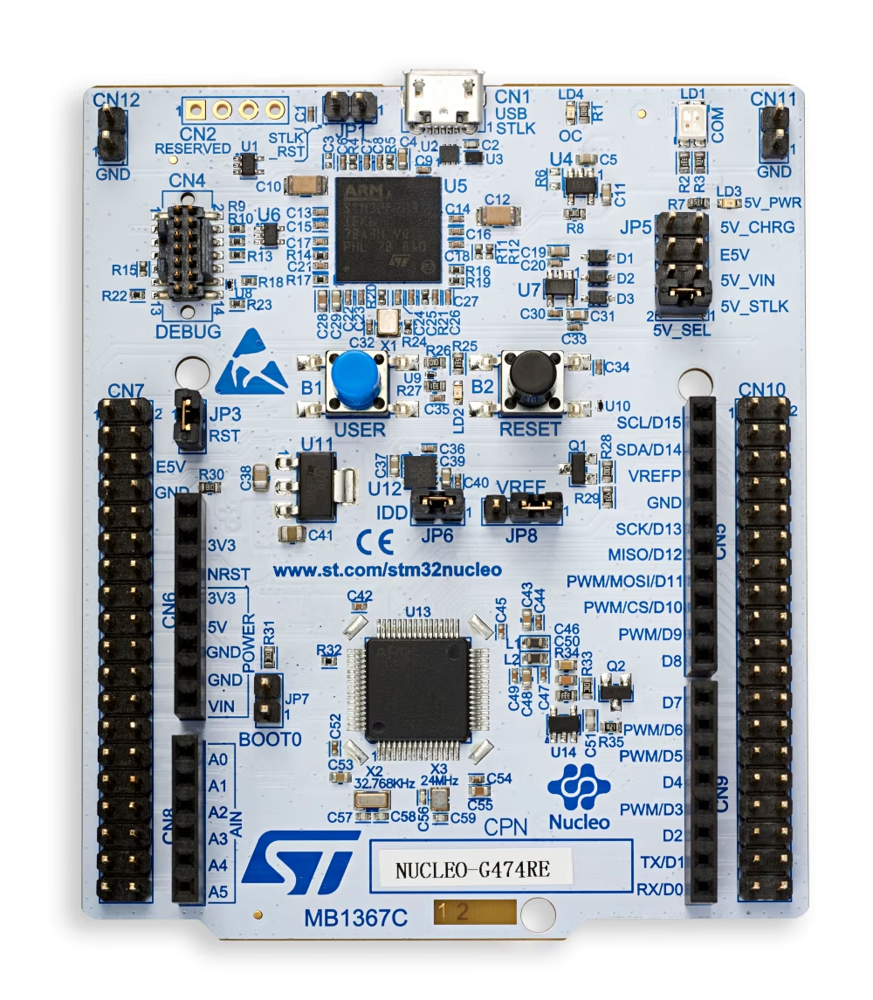

# STM32_NucleoG474



NUCLEO-G474RE geliştirme kartı için hazırlanan örnek projelerin tutulduğu depo.

Her örnek kendi klasöründe, bağımsız ve derlenebilir bir proje olarak yer alır.
Yeni bir örnek eklendikçe bu listeye yeni bir satır eklenir.

## Kart

- **MCU:** STM32G474RET6 (Arm Cortex-M4)
- **Board:** NUCLEO-G474RE
- Tüm örnekler gerçek STM32 CMSIS/HAL kütüphanesini kullanır (`Drivers/CMSIS`, `Drivers/STM32G4xx_HAL_Driver`); her klasör kendi minimal HAL modül alt kümesiyle bağımsız olarak derlenir.

## Klasörler

| Klasör | Açıklama |
|---|---|
| [`buton_on_off/`](buton_on_off) | Kullanıcı butonuna (B1) basılı tutulduğunda kullanıcı LED'ini (LD2) yakan, bırakınca söndüren örnek (`HAL_GPIO_ReadPin`/`WritePin`) |
| [`buton_toggle/`](buton_toggle) | Kullanıcı butonuna (B1) her basıldığında kullanıcı LED'inin (LD2) durumunu tersine çeviren (toggle) örnek (`HAL_GPIO_TogglePin`, debounce için `HAL_Delay`) |
| [`timer_blink/`](timer_blink) | `HAL_Delay()` kullanmadan, TIM3 donanım zamanlayıcısının kesmesiyle (interrupt) her 500 ms'de bir LED yakıp söndüren örnek (`HAL_TIM_Base_Start_IT`, `HAL_TIM_PeriodElapsedCallback`) |
| [`uart_led_control/`](uart_led_control) | PC'den terminal üzerinden (USART2, ST-Link VCP) `LED ON` / `LED OFF` / `STATUS` komutlarıyla kartı kontrol eden örnek (`HAL_UART_Receive_IT`, RX buffer + string parsing) |
| [`adc_pwm_dimmer/`](adc_pwm_dimmer) | Potansiyometre (ADC, PA0) ile LED parlaklığını (PWM, TIM2/PA5) analog kontrol eden örnek; anlık ADC/duty değerleri USART2 üzerinden seri terminale de akar |
| [`ntc_temperature/`](ntc_temperature) | NTC termistör (ADC, PA0 + gerilim bölücü) ile ortam sıcaklığını okuyup USART2 üzerinden seri terminale akıtan örnek; Beta denklemi `log()` yerine önceden hesaplanmış bir lookup table ile çözülür (bkz. README'deki toolchain notu) |
| [`ds18b20_temperature/`](ds18b20_temperature) | DS18B20 dijital sıcaklık sensörünü **1-Wire** protokolüyle (PA0, elle bit-banging + DWT çevrim sayacıyla mikro-saniye zamanlama) okuyup USART2 üzerinden seri terminale akıtan örnek |
| [`oled_i2c_display/`](oled_i2c_display) | SSD1306 I2C OLED ekranda DS18B20 sıcaklığını ve buton ile kontrol edilen LED durumunu gösteren örnek; üçüncü parti (MIT lisanslı) bir OLED sürücü kütüphanesinin projeye nasıl entegre edildiğini de anlatır |
| [`exti_button_led/`](exti_button_led) | `buton_toggle` ile aynı davranış (basınca LED toggle), ama polling yerine gerçek bir donanım kesmesiyle (**EXTI**, `HAL_GPIO_EXTI_Callback`) |
| [`apds9960_proximity_color/`](apds9960_proximity_color) | APDS-9960 (I2C) ile yakınlık ve RGB/clear ışık verisini okuyup USART2'ye akıtan örnek; başta I2C tarama + cihaz ID kontrolüyle bağlantı doğrulanır |
| [`apds9960_gesture/`](apds9960_gesture) | Aynı APDS-9960 ile yukarı/aşağı/sol/sağ el hareketi (gesture) algılama; sadece hareket algılandığında UART'a tek satır yazar, dört yön de gerçek donanımla doğrulandı |
| [`adc_dma_sampling/`](adc_dma_sampling) | Potansiyometre (ADC, PA0) verisini CPU hiç yoklamadan (polling yapmadan) **DMA** ile sürekli okuyan örnek; dairesel (circular) tampon + yarım/tam "ping-pong" callback deseni, DMAMUX üzerinden esnek kanal yönlendirmesi |
| [`adc_internal_temp/`](adc_internal_temp) † | Çipin **dahili sıcaklık sensörünü** ADC ile okuyup her saniye USART2 üzerinden seri terminale akıtan örnek; buton (B1) EXTI kesmesiyle LED'i (LD2) aç/kapat yapıp durumu da seri porta yazar (bkz. README'deki ADC saat hızı notu) |

† `adc_internal_temp`, STM32Cube for VS Code'un daha yeni proje
şablonuyla (`Core/Inc`/`Core/Src` + NUCLEO BSP kütüphanesi) oluşturuldu,
diğer klasörler gibi `Inc`/`Src` + ham HAL değil — ayrıntı için o
klasörün README'sindeki "Klasör yapısı hakkında" bölümüne bakın.
Build/flash adımları aynı şekilde çalışır.

## Ortak build/flash yöntemi

Tüm klasörler STM32CubeCLT / STM32Cube for VS Code eklentisiyle gelen `cube-cmake` ve `cube` araçlarını kullanır:

```bash
cd <klasör_adı>
cube-cmake --preset Debug
cube-cmake --build --preset Debug
cube programmer -c port=SWD -w build/Debug/<proje>.elf -v -rst
```

ST-Link kartın üzerinde entegre olduğu için ekstra bir programlayıcıya gerek yoktur; USB ile PC'ye bağlamak yeterlidir.
