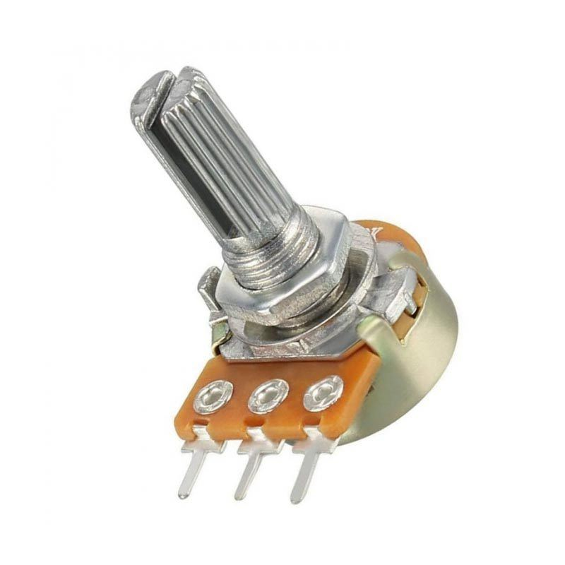

# adc_pwm_dimmer



Potansiyometre + ADC + PWM birleşimiyle kullanıcı LED'inin (**LD2**)
parlaklığını analog olarak kontrol eden örnek. Potu çevirdikçe LED
kapalıdan tam parlaklığa kadar **kademesiz** (yumuşak) geçiş yapar.
Ayrıca anlık ADC/duty değerleri **USART2 üzerinden seri terminale**
akıtılır, böylece LED'e bakmadan da sayısal olarak takip edilebilir.

```
Potansiyometre (0-3.3V) → PA0 → ADC1 (12-bit) → ölçekleme → TIM2 CCR1 → PA5 PWM → LED parlaklığı
                                                                              │
                                                                    USART2 (PA2) → PC terminali
```

## Donanım bağlantısı

| Parça | Bağlantı |
|---|---|
| Potansiyometre – uç 1 | 3V3 |
| Potansiyometre – uç 2 | GND |
| Potansiyometre – orta uç (wiper) | **PA0** (Arduino başlığında `A0`) |
| LD2 (kullanıcı LED'i) | PA5 (kartın üzerinde, ekstra kablo gerekmez) |
| USART2 TX/RX | PA2 / PA3 (ST-Link VCP'ye dahili bağlı, ekstra kablo gerekmez) |

## Terminalden izleme

Kartın ST-Link COM portuna **115200 8N1** ile bağlanınca ~200ms'de bir
şu formatta satırlar akar:

```
ADC:  2048  Duty:  50%
ADC:  3800  Duty:  92%
ADC:     0  Duty:   0%
```

> Bu projede **komut göndermeniz gerekmiyor** — kart sadece veri
> yolluyor (TX). `uart_led_control` örneğindeki satır sonu (line ending)
> ayarı burada önemli değil, çünkü kart herhangi bir giriş beklemiyor.

## Pot çevirince ne olmalı

| Pot konumu | ADC (yaklaşık) | LED |
|---|---|---|
| Sonuna kadar GND'ye | ~0 | Kapalı |
| ~1/4 | ~1024 | Düşük parlaklık |
| Orta | ~2048 | Orta parlaklık |
| Sonuna kadar 3V3'e | ~4095 | Maksimum parlaklık |

## Çalışma mantığı

### ADC tarafı — [main.c](Src/main.c)

- **`MX_ADC1_Init()`**: ADC1'i PA0 (kanal 1) için 12-bit çözünürlükte,
  **sürekli dönüştürme modunda** (`ContinuousConvMode = ENABLE`) kurar.
  Yazılım tetiklemesi (`ADC_SOFTWARE_START`) kullanılır, harici bir
  tetikleyici (timer, GPIO vb.) yoktur.
- **`HAL_ADCEx_Calibration_Start(&hadc1, ADC_SINGLE_ENDED)`**: STM32G4'ün
  ADC'si her açılışta küçük bir donanımsal ofset hatası taşır; bu adım
  onu ölçüp otomatik düzeltir. Atlanırsa okumalar birkaç LSB kayabilir.
- Ana döngüde `HAL_ADC_Start()` **bir kere** çağrılır (sürekli mod
  olduğu için tekrar tetiklemeye gerek yok), sonra her turda
  `HAL_ADC_PollForConversion()` ile yeni bir örneğin hazır olup
  olmadığına bakılır — kesme kullanılmaz, çünkü bu dersin odağı
  ADC+PWM birlikteliği (interrupt zaten `timer_blink` ve
  `uart_led_control` derslerinde işlendi).

### PWM tarafı

- **`MX_TIM2_PWM_Init()`**: TIM2'yi PA5 üzerinde (`TIM_CHANNEL_1`,
  `GPIO_AF1_TIM2`) PWM üretecek şekilde kurar. TIM2, APB1'de ve
  varsayılan olarak 16 MHz (HSI) ile besleniyor:
  - `Prescaler = 15` → 16 MHz / 16 = **1 MHz** sayaç saati
  - `Period = 999` → 1000 sayımda bir tur = **1 kHz PWM** (göz flicker
    görmez)
- **Ölçekleme** (kodun kalbi): `duty = adc_value * 1000 / 4096`. ADC'nin
  12-bit çıktısı (0-4095) PWM'in 0-999 aralığına doğrusal olarak
  eşlenir — bu, 0V-3.3V girişini doğrudan %0-%100 parlaklığa çevirir.
- **`__HAL_TIM_SET_COMPARE(&htim2, TIM_CHANNEL_1, duty)`**: her yeni ADC
  örneğinde PWM'in karşılaştırma (CCR) kaydını canlı günceller; LED
  anlık olarak yeni parlaklığa geçer.

### UART tarafı (izleme)

- **`MX_USART2_UART_Init()`**: `uart_led_control` örneğindekiyle aynı
  115200 8N1 kurulumu, ama bu sefer **sadece TX** kullanılır — kesme
  tabanlı alım (RX) yok, çünkü kart komut beklemiyor, sadece veri
  yayınlıyor.
- Her ADC örneğinde ekrana basmak terminali sel basardı (saniyede
  binlerce satır); bu yüzden `HAL_GetTick()` ile **200ms'de bir**
  basılacak şekilde kısılır (throttle). PWM güncellemesi yine her
  örnekte anlık yapılır — sadece ekrana yazma yavaşlatılır.
- `snprintf()` ile tek bir buffer'da biçimlendirilip
  `HAL_UART_Transmit()` (bloklayan, kesmesiz) ile gönderilir.

## Derleme ve yükleme

STM32Cube for VS Code eklentisiyle gelen `cube-cmake` ve `cube` araçları kullanılır.

```bash
cube-cmake --preset Debug
cube-cmake --build --preset Debug
cube programmer -c port=SWD -w build/Debug/STM32G474RE.elf -v -rst
```

Kart, ST-Link programlayıcısı üzerinden USB ile bilgisayara bağlı olmalıdır.

## Klasör yapısı hakkında

`Drivers/` klasörü, STMicroelectronics'in resmi CMSIS ve HAL kaynak
kodlarından (STM32CubeG4 firmware paketi) yalnızca bu örnek için gereken
minimal alt kümeyi içerir: `RCC`, `GPIO`, `DMA`, `EXTI`, `FLASH`, `PWR`,
`CORTEX`, `TIM`, `ADC` ve `UART` modülleri. `Inc/stm32g4xx_hal_conf.h`,
hangi HAL modüllerinin derlemeye dahil edildiğini kontrol eden
yapılandırma dosyasıdır.
