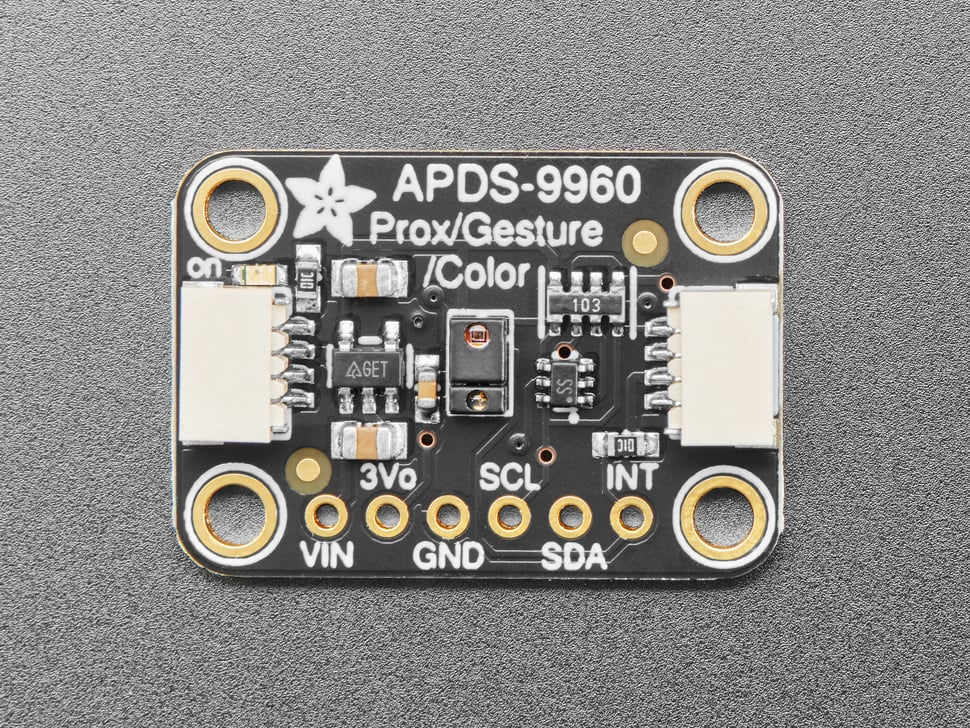

# apds9960_gesture



[apds9960_proximity_color](../apds9960_proximity_color)'daki aynı
sensörle, bu sefer **yukarı/aşağı/sol/sağ el hareketi algılama**
(gesture detection). Seri terminal normalde tamamen **sessizdir** —
sadece gerçek bir el hareketi algılandığında tek satır yazar.

Gerçek donanımda dört yön de doğrulandı:

```
Gesture: UP     (diff_ud=-247 diff_lr=1)
Gesture: DOWN   (diff_ud=177 diff_lr=-16)
Gesture: LEFT   (diff_ud=-30 diff_lr=-176)
Gesture: RIGHT  (diff_ud=-86 diff_lr=193)
```

## Donanım bağlantısı

| Sinyal | Pin | Açıklama |
|---|---|---|
| APDS-9960 VIN | 3V3 | |
| APDS-9960 GND | GND | |
| APDS-9960 SCL | **PB8** | I2C1, AF4 |
| APDS-9960 SDA | **PB9** | I2C1, AF4 |
| USART2 TX/RX | PA2 / PA3 | ST-Link VCP, 115200 8N1 |

Açılışta [apds9960_proximity_color](../apds9960_proximity_color)'daki
gibi bir I2C taraması + ID register kontrolü (`0xAB` beklenir) yapılır,
sonra sürekli olarak sadece **gesture motoru** (proximity/renk motorları
değil) çalışır.

## Nasıl çalışıyor: APDS-9960'ın gesture motoru

Sensörün etrafında **dört fotodiyot** var: Yukarı (U), Aşağı (D), Sol
(L), Sağ (R). Bir nesne (elinizi) sensörün üzerinden geçirdiğinizde,
her fotodiyot nesneyi farklı bir zamanda ve farklı bir şiddette
"görür" — örneğin elinizi yukarıdan aşağıya indirirseniz, önce U
diyotu güçlü sinyal alır, en son D diyotu güçlü sinyal alır. Sensör
bu dört değeri (U,D,L,R) sürekli örnekleyip kendi dahili **GFIFO**
tamponuna yazıyor; biz bu tamponu I2C üzerinden okuyoruz.

### Basitleştirilmiş yön algoritması

Gerçek gesture kütüphaneleri (Adafruit/SparkFun) FIFO'daki **her**
örneği ağırlıklandırıp karmaşık bir karar matrisi kullanıyor. Burada
kasıtlı olarak basitleştirilmiş bir yaklaşım var:

1. Bir hareket başladığında (proximity `GPENTH` eşiğini aşınca) FIFO'nun
   **ilk** (U,D,L,R) örneği kaydedilir.
2. Hareket bitene kadar (`GEXTH` eşiğinin altına düşünce) gelen her
   örnek **son** değer olarak güncellenir.
3. Hareket bitince: `diff_ud = (son_U - son_D) - (ilk_U - ilk_D)`,
   `diff_lr = (son_L - son_R) - (ilk_L - ilk_R)` hesaplanır.
4. Hangi eksenin mutlak değeri **belirgin şekilde** (`GESTURE_AXIS_MARGIN_PCT`,
   şu an %40) daha büyükse, o eksende bir hareket olduğuna karar
   verilir; işaretine göre yön belirlenir.

Bu yaklaşım hızlı/net hareketlerde iyi çalışıyor (bkz. yukarıdaki
gerçek ölçümler: 247 vs 1, 193 vs 86 gibi büyük farklar), ama
belirsiz/yavaş/çapraz hareketlerde ("hangi eksen kazandı" net değilse)
`GESTURE_NONE` döner — yanlış tahmin etmek yerine sessiz kalmayı
tercih eder.

### Kalibrasyon süreci — işaretler neden ters çevrildi

İlk denemede **UP/DOWN ve LEFT/RIGHT ikisi de ters** çıktı — bu,
fiziksel donanımın (sensör modülünün PCB üzerindeki yönü/döndürülmesi)
datasheet'in varsaydığı varsayılan yönle birebir eşleşmemesinden
kaynaklanıyor; bu tür bir sapma farklı üretici/modül varyantlarında
sık görülür. Çözüm kör bir tahmin değil, **gerçek ölçümle
doğrulama**: `apds9960_poll_gesture()` her tamamlanan harekette ham
`diff_ud`/`diff_lr` değerlerini de UART'a yazdıracak şekilde
genişletildi, kullanıcı sırasıyla yukarı→aşağı→sol→sağ hareketleri
yapıp gerçek çıktıyı bildirdi, iki eksenin işareti buna göre koddaki
`return` ifadelerinde çevrildi (bkz. [main.c](Src/main.c)'teki
yorumlar). Başka bir APDS-9960 modülünde bu işaretler yine ters
çıkabilir — aynı yöntemle (diff değerlerini gözlemleyip işaret
çevirerek) tekrar kalibre edilebilir.

## Neler eklenmedi

- **Çapraz/döngüsel hareketler** (örn. saat yönünde dairesel el
  hareketi) algılanmıyor — sadece tek eksenli (U/D veya L/R) net
  hareketler.
- **Kesme (interrupt) tabanlı tetikleme**: sensörün `INT` pini
  kullanılabilir ama bu örnek basitlik için polling kullanıyor
  (`apds9960_poll_gesture()` her 50ms'de bir çağrılıyor).

## Derleme ve yükleme

STM32Cube for VS Code eklentisiyle gelen `cube-cmake` ve `cube` araçları kullanılır.

```bash
cube-cmake --preset Debug
cube-cmake --build --preset Debug
cube programmer -c port=SWD -w build/Debug/STM32G474RE.elf -v -rst
```

Kart, ST-Link programlayıcısı üzerinden USB ile bilgisayara bağlı olmalıdır.

## Klasör yapısı hakkında

`Drivers/` klasörü, STMicroelectronics'in resmi CMSIS ve HAL kaynak
kodlarından yalnızca bu örnek için gereken minimal alt kümeyi içerir:
`RCC`, `GPIO`, `DMA`, `EXTI`, `FLASH`, `PWR`, `CORTEX`, `I2C` ve
`UART` modülleri. `Inc/stm32g4xx_hal_conf.h`, hangi HAL modüllerinin
derlemeye dahil edildiğini kontrol eden yapılandırma dosyasıdır.
