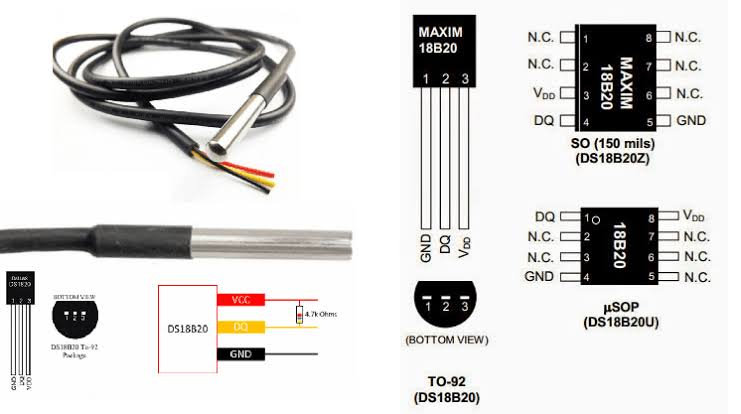

# ds18b20_temperature



DS18B20 dijital sıcaklık sensörünü **1-Wire** protokolüyle okuyup
USART2 üzerinden seri terminale akıtan örnek. `ntc_temperature`'dan
farkı: NTC analog bir dirençtir (ADC ile okunur), DS18B20 ise kendi
içinde bir ADC ve dijital arayüz barındırır — HAL'de hazır bir 1-Wire
çevre birimi olmadığından, veri hattı **elle (bit-banging) sürülür**.

Gerçek donanımda doğrulandı — oda sıcaklığında örnek çıktı:

```
Temperature: 25.7 C
Temperature: 25.7 C
Temperature: 25.7 C
```

## Donanım bağlantısı

```
STM32 3V3 ──┬──────────────── DS18B20 VDD (kırmızı)
            │
          4.7kΩ
            │
STM32 PA0 ──┴──────────────── DS18B20 DATA (sarı)
STM32 GND ──────────────────── DS18B20 GND (siyah)
```

| Sinyal | Bağlantı |
|---|---|
| DS18B20 VDD | 3V3 |
| DS18B20 GND | GND |
| DS18B20 DATA | **PA0** — aynı noktada 4.7kΩ direncin bir ucu da 3V3'e bağlanır (pull-up) |
| USART2 TX/RX | PA2 / PA3 (ST-Link VCP'ye dahili bağlı, ekstra kablo gerekmez) |

> **Pull-up direnci şart:** 1-Wire hattı open-drain çalışır, yani
> hattı sadece LOW'a çekebilir, hiçbir zaman aktif olarak HIGH
> sürmez — "yüksek" durumda kalması için harici bir pull-up dirence
> ihtiyaç var. Çıplak TO-92 paketli DS18B20'lerde bu direnç
> **mutlaka eklenmelidir**. Su geçirmez prob modüllerinde çoğu zaman
> kablonun/modülün içinde zaten mevcuttur; önce dirençsiz deneyip
> "presence pulse" alınamıyorsa (bkz. aşağıda) harici 4.7kΩ eklenir.

## Terminalden izleme

Kartın ST-Link COM portuna **115200 8N1** ile bağlanınca ~1 saniyede
bir `Temperature: xx.x C` satırı akar. Sensör bulunamazsa (kablolama
veya pull-up sorunu) şu mesaj görülür:

```
DS18B20 not found (no presence pulse) - check wiring/pull-up
```

## Çalışma mantığı

### Neden HAL'de hazır bir "1-Wire" fonksiyonu yok?

1-Wire, I2C/SPI gibi bir donanım çevre birimi (peripheral) değil —
tek bir veri hattı üzerinden **kesin mikro-saniye zamanlamasına**
dayalı bir protokol. STM32 bunu donanımsal desteklemiyor, bu yüzden
hattı GPIO ile elle ("bit-banging") sürmek gerekiyor.

### PA0'ın hem çıkış hem giriş olarak kullanılması

PA0, `GPIO_MODE_OUTPUT_OD` (**open-drain çıkış**) olarak **bir kere**
ayarlanır ve program boyunca hiç değiştirilmez:

- `OW_Low()` → pini gerçekten LOW'a çeker (hattı kısa devre eder).
- `OW_Release()` → pini "HIGH" yapar, ama open-drain olduğu için bu
  aslında pini **bırakmak** demektir — gerçek yüksek seviyeyi harici
  pull-up direnci sağlar.
- `OW_Read()` → `HAL_GPIO_ReadPin()` ile pinin **gerçek** anlık
  seviyesini okur; bu, `MODER` ayarından bağımsız her zaman çalışır.
  Bu sayede DS18B20'nin hattı LOW'a çekerek gönderdiği cevapları
  (presence pulse, okunan bitler) aynı pin üzerinden algılayabiliyoruz,
  hiç yön (mode) değiştirmeden.

### Mikro-saniye gecikmesi: DWT çevrim sayacı

`HAL_Delay()` sadece milisaniye hassasiyetinde ve SysTick'e dayalı;
1-Wire'ın 6-480 mikro-saniyelik zaman dilimleri için yetersiz. Bunun
yerine Cortex-M4'ün **DWT (Data Watchpoint and Trace) çevrim sayacı**
kullanılır:

- `DWT_Init()`: `DWT->CYCCNT` sayacını sıfırlayıp etkinleştirir —
  bu sayaç, işlemcinin her saat çevriminde (16 MHz'de 62.5 ns) bir artar.
- `delay_us(us)`: istenen mikro-saniyeyi çevrim sayısına çevirip
  (`us × SystemCoreClock/1.000.000`), sayaç o kadar ilerleyene kadar
  bekler. Ekstra bir timer periferiği gerekmez.

### 1-Wire protokol adımları — [main.c](Src/main.c)

- **`OW_Reset()`**: Hattı 480µs LOW'a çekip bırakır; DS18B20 varsa
  70-410µs arasında hattı kendisi kısa süreliğine LOW'a çekerek
  ("presence pulse") varlığını bildirir. Bu pulse yoksa sensör
  bağlı/çalışır değildir.
- **`OW_WriteBit()` / `OW_ReadBit()`**: Her "zaman dilimi" (~70µs)
  içinde hattın ne kadar süre LOW tutulduğuna göre 0 ya da 1
  gönderilir/okunur — datasheet'teki standart süreler birebir
  kullanılmıştır (yazma 1: 6µs LOW; yazma 0: 60µs LOW; okuma: 6µs LOW
  tetikleme + 9µs sonra örnekleme).
- **`0xCC` (Skip ROM)**: Hatta tek cihaz olduğu varsayılıp adresleme
  atlanır.
- **`0x44` (Convert T)**: Sıcaklık ölçümünü başlatır; 12-bit
  çözünürlükte tamamlanması **en fazla 750ms** sürer, bu yüzden
  okumadan önce `HAL_Delay(750)` ile beklenir.
- **`0xBE` (Read Scratchpad)**: Sonucu okur; ilk iki bayt (LSB, MSB)
  16-bit işaretli bir tam sayı oluşturur, her LSB **1/16 °C**'ye denk
  gelir (`t_onda_bir = raw × 10 / 16`), böylece kayan nokta
  kullanmadan ondalıklı sıcaklık elde edilir.

## Derleme ve yükleme

STM32Cube for VS Code eklentisiyle gelen `cube-cmake` ve `cube` araçları kullanılır.

```bash
cube-cmake --preset Debug
cube-cmake --build --preset Debug
cube programmer -c port=SWD -w build/Debug/STM32G474RE.elf -v -rst
```

Kart, ST-Link programlayıcısı üzerinden USB ile bilgisayara bağlı olmalıdır.

## Klasör yapısı hakkında

`Drivers/` klasörü, STMicroelectronics'in resmi CMSIS ve HAL kaynak
kodlarından (STM32CubeG4 firmware paketi) yalnızca bu örnek için gereken
minimal alt kümeyi içerir: `RCC`, `GPIO`, `DMA`, `EXTI`, `FLASH`, `PWR`,
`CORTEX` ve `UART` modülleri. ADC bu projede kullanılmaz (sensör
kendi ADC'sini içeriyor). `Inc/stm32g4xx_hal_conf.h`, hangi HAL
modüllerinin derlemeye dahil edildiğini kontrol eden yapılandırma
dosyasıdır.
