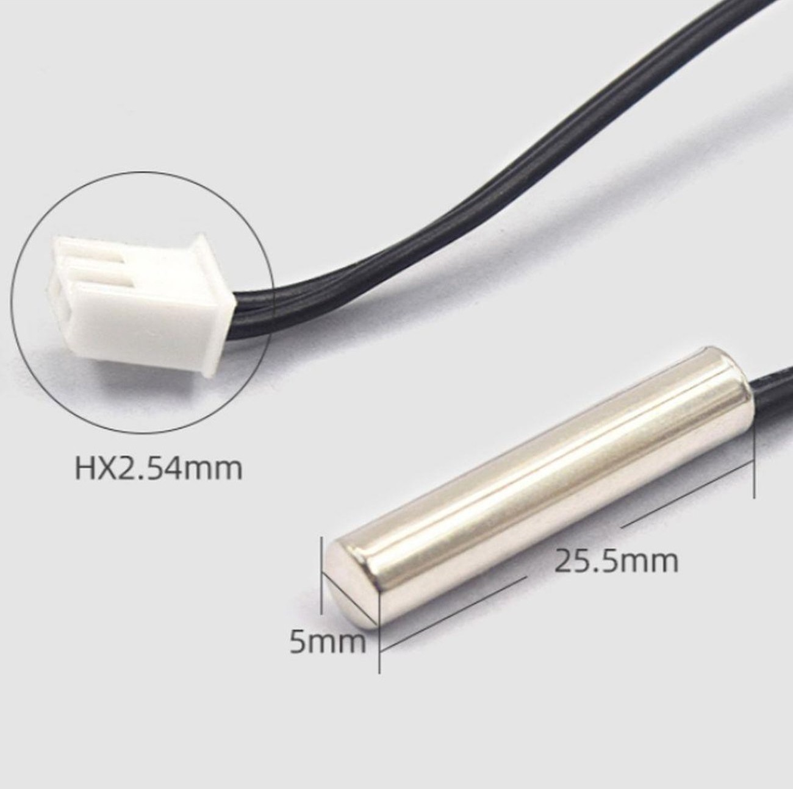

# ntc_temperature



NTC termistör ile ortam sıcaklığını okuyup **USART2 üzerinden seri
terminale** akıtan örnek. `adc_pwm_dimmer` örneğindeki "STATUS"
komutunun placeholder `Temperature: 24.5 C` değerinin yerini artık
**gerçek bir sensör okuması** alıyor.

Gerçek donanımda doğrulandı — oda sıcaklığında örnek çıktı:

```
ADC: 2165  Temperature: 27.6 C
ADC: 2149  Temperature: 27.2 C
ADC: 2137  Temperature: 26.9 C
```

## Donanım bağlantısı

NTC prob (çıplak 2 telli, JST konnektörlü, ~10kΩ @25°C, Beta≈3950) ve
sabit bir 10kΩ direnç ile gerilim bölücü kurulur:

```
STM32 3V3 ──── NTC ────┬──── 10kΩ direnç ──── STM32 GND
                        │
                    STM32 PA0  (Arduino başlığında "A0")
```

| Parça | Bağlantı |
|---|---|
| NTC – uç 1 | 3V3 |
| NTC – uç 2 | **PA0** (ADC1_IN1) **ve** 10kΩ direncin bir ucu (aynı noktada birleşir) |
| 10kΩ direnç – diğer uç | GND |
| USART2 TX/RX | PA2 / PA3 (ST-Link VCP'ye dahili bağlı, ekstra kablo gerekmez) |

> NTC'nin polaritesi yok (sıradan direnç gibi), ama **yönü önemli**:
> NTC üstte (3V3 tarafında), sabit direnç altta (GND tarafında) olmalı.
> Bu sayede sıcaklık arttıkça NTC direnci düşer, PA0'daki gerilim (ve
> dolayısıyla ADC okuması) **yükselir**. Ters bağlanırsa ilişki ters
> yönde çalışır ve kod yanlış sonuç üretir.

## Terminalden izleme

Kartın ST-Link COM portuna **115200 8N1** ile bağlanınca ~500ms'de bir
`ADC: xxxx  Temperature: xx.x C` satırları akar. Bu proje de
`adc_pwm_dimmer` gibi sadece **TX** kullanır, komut göndermenize gerek yok.

## ⚠️ Önemli not: Beta denklemi neden `log()` ile değil, lookup table ile hesaplanıyor

NTC direncinden sıcaklığa geçiş standart olarak **Beta denklemi** ile yapılır:

```
1/T = 1/T0 + (1/B) * ln(R/R0)
```

Bu denklem matematiksel olarak `log()` (doğal logaritma) gerektirir.
Ancak bu projede kullanılan STM32Cube paketiyle gelen bundled
`arm-none-eabi-gcc`/`ld` araç zincirinde, `log()` (ve `logf()`,
`sqrtf()` gibi diğer libm fonksiyonları) bu projenin tam HAL kaynak
kümesi + özel linker script'i ile birleşince şu hatayı veriyor:

```
undefined reference to `log'
(log): Unknown destination type (ARM/Thumb)
dangerous relocation: unsupported relocation
```

Bu, derleyicinin `libm.a` içindeki ilgili fonksiyonların **Thumb
mapping sembollerini** doğru paketlememesinden kaynaklanan bir **araç
zinciri (toolchain) hatası** — proje kodunun veya linker script'in bir
hatası değil. (Doğrulama: aynı `log()` çağrısı çok az sayıda dosyayla
tek başına derlendiğinde sorunsuz linkleniyor; sadece bu projedeki tam
HAL nesne dosyası kümesiyle birleşince ortaya çıkıyor.)

**Çözüm:** Beta denklemi **önceden (bilgisayarda) hesaplanıp** 33
noktalık bir ADC↔Sıcaklık tablosuna gömüldü
([main.c](Src/main.c)'teki `ADC_POINTS[]` / `TEMP_TENTHS[]`), kart
çalışırken sadece bu iki nokta arasında **tam sayı aritmetiğiyle
doğrusal interpolasyon** yapıyor — hiç `log()` çağrısı yok. Bu,
matematiksel olarak aynı sonucu verir ve ayrıca gömülü sistemlerde
zaten yaygın kullanılan, kayan nokta transandantal fonksiyonlardan
kaçınan standart bir teknik.

### Kod parçaları — [main.c](Src/main.c)

- **`ADC_POINTS[]` / `TEMP_TENTHS[]`**: ADC 1'den 4094'e kadar 33
  eşit aralıklı noktada, o ADC değerine karşılık gelen sıcaklığın
  (×10, örn. 235 = 23.5°C) önceden hesaplanmış hâli.
- **`adc_to_celsius_tenths()`**: Gelen ADC değerini tabloda hangi iki
  nokta arasına düştüğünü bulup, aradaki doğruyu kullanarak (doğrusal
  interpolasyon) sıcaklığı hesaplar. Uç değerlerin dışına taşan
  okumalar tablonun ilk/son noktasına kırpılır (clamp).
- **Sıcaklık yazdırma**: `%.1f` gibi kayan nokta biçimlendirmesi yerine
  tam sayı onda birlik değer (`t_tenths`) elle `tam_kısım.ondalık_kısım`
  şeklinde string'e çevrilir — bu da tamamen kayan nokta printf/log
  bağımlılığından bağımsız, sağlam bir yöntem.

## Derleme ve yükleme

STM32Cube for VS Code eklentisiyle gelen `cube-cmake` ve `cube` araçları kullanılır.

```bash
cube-cmake --preset Debug
cube-cmake --build --preset Debug
cube programmer -c port=SWD -w build/Debug/STM32G474RE.elf -v -rst
```

Kart, ST-Link programlayıcısı üzerinden USB ile bilgisayara bağlı olmalıdır.

## Klasör yapısı hakkında

`Drivers/` klasörü, STMicroelectronics'in resmi CMSIS ve HAL kaynak
kodlarından (STM32CubeG4 firmware paketi) yalnızca bu örnek için gereken
minimal alt kümeyi içerir: `RCC`, `GPIO`, `DMA`, `EXTI`, `FLASH`, `PWR`,
`CORTEX`, `ADC` ve `UART` modülleri. `Inc/stm32g4xx_hal_conf.h`, hangi
HAL modüllerinin derlemeye dahil edildiğini kontrol eden yapılandırma
dosyasıdır.
