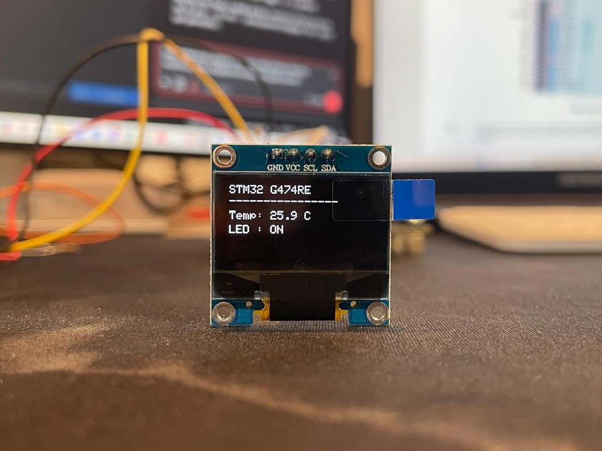

# oled_i2c_display



SSD1306 tabanlı 128x64 I2C OLED ekranda kart durumunu gösteren örnek —
bu depodaki en "bütünsel" proje, çünkü daha önceki derslerin çoğunu
(GPIO, buton, 1-Wire, ve şimdi I2C) tek bir uygulamada birleştiriyor.
Aynı zamanda **başkasının yazdığı bir kütüphaneyi projeye entegre etme**
dersi: SSD1306 sürücüsü kendi yazdığımız kod değil, MIT lisanslı
üçüncü parti bir kütüphane ([aşağıya bakın](#kütüphane-entegrasyonu)).

Gerçek donanımda doğrulandı — ekranda görülen çıktı:

```
STM32 G474RE
----------------
Temp: 24.6 C
LED : OFF
```

## Donanım bağlantısı

| Sinyal | Pin | Açıklama |
|---|---|---|
| OLED VCC | 3V3 | |
| OLED GND | GND | |
| OLED SCL | **PB8** | I2C1, AF4 |
| OLED SDA | **PB9** | I2C1, AF4 |
| DS18B20 DATA | **PA0** | 1-Wire, 4.7kΩ pull-up'lı (bkz. [ds18b20_temperature](../ds18b20_temperature)) |
| B1 (kullanıcı butonu) | PC13 | LED'i açar/kapatır |
| LD2 (kullanıcı LED'i) | PA5 | |

> Çoğu ucuz I2C OLED modülünde SCL/SDA hatları için pull-up dirençleri
> zaten modülün üzerindedir; koddaki dahili `GPIO_PULLUP` da ek bir
> güvenlik önlemi olarak açık tutulmuştur.

## Ekranda gösterilenler

- **Satır 1-2**: sabit başlık ve ayraç.
- **Temp**: DS18B20'den 1-Wire ile okunan gerçek sıcaklık (bkz.
  [ds18b20_temperature](../ds18b20_temperature) — aynı bit-banging
  kodu burada da kullanılıyor).
- **LED**: B1 butonuna her basışta LD2'nin açık/kapalı durumu
  (`buton_toggle` ile aynı basma-algılama + debounce mantığı).

## I2C nedir, bu projede nasıl kullanılıyor?

I2C (Inter-Integrated Circuit), sadece **2 hat** (SCL=saat, SDA=veri)
ile birden fazla cihazın aynı hat üzerinde haberleşebildiği bir
protokol — her cihazın hat üzerinde benzersiz bir **adresi** vardır,
master (STM32) bu adresi göndererek "şimdi seninle konuşuyorum" der.

- **I2C adresi**: SSD1306 modüllerinin çoğu 7-bit adresi `0x3C`'dir
  (bazılarında `0x3D`, genelde modül üzerindeki bir lehim köprüsüyle
  seçilir). HAL fonksiyonları adresi **8-bit'e kaydırılmış** (`<<1`)
  hâliyle bekler, bu yüzden kodda `SSD1306_I2C_ADDR` `(0x3C << 1)`
  olarak tanımlı — bu, adresin 7 biti + okuma/yazma yön bitinin birlikte
  gönderildiği I2C çerçeve formatından kaynaklanır.
- **`HAL_I2C_Master_Transmit()` ile `HAL_I2C_Mem_Write()` ilişkisi**:
  Kullandığımız SSD1306 kütüphanesi dahili olarak `HAL_I2C_Master_Transmit()`
  değil, `HAL_I2C_Mem_Write()` çağırıyor ([ssd1306.c](Middlewares/SSD1306/ssd1306.c)
  satır 14 ve 19). Aralarındaki fark sadece kolaylık: `HAL_I2C_Mem_Write(hi2c,
  addr, kayıt_adresi, kayıt_boyutu, buffer, len, timeout)`, aslında
  `[kayıt_adresi] + [buffer]` şeklinde birleştirilmiş bir diziyi
  `HAL_I2C_Master_Transmit()` ile göndermenin hazır bir sarmalayıcısıdır.
  SSD1306 için "kayıt adresi" aslında bir **kontrol baytı**dır:
  `0x00` = "bundan sonrası bir komut", `0x40` = "bundan sonrası ekran
  verisi (buffer)". Yani `HAL_I2C_Mem_Write(&hi2c1, addr, 0x00, 1, &cmd, 1, ...)`
  ile `[0x00, cmd]` dizisini `HAL_I2C_Master_Transmit()` ile göndermek
  fonksiyonel olarak birebir aynı sonucu verir — SSD1306 kütüphanesi
  sadece daha kısa yazım için `Mem_Write`'ı tercih etmiş.
- **`HAL_I2C_Mem_Write` içeriden nasıl çalışır**: STM32'nin I2C
  donanımı START koşulunu üretir, 7-bit adres + yazma bitini gönderir,
  slave (OLED) ACK verirse kontrol baytını ve ardından buffer'ı art
  arda yollar, sonunda STOP koşulunu üretir — tüm bu düşük seviye
  adımları HAL bizim yerimize hallediyor.

## Kütüphane entegrasyonu

Bu projede kullanılan SSD1306 sürücüsü
[afiskon/stm32-ssd1306](https://github.com/afiskon/stm32-ssd1306)
adlı, **MIT lisanslı** açık kaynak bir kütüphane (lisans metni:
[`Middlewares/SSD1306/LICENSE-ssd1306.txt`](Middlewares/SSD1306/LICENSE-ssd1306.txt)).
Kendi yazdığımız kodun aksine, bunu **olduğu gibi** projeye ekleyip
sadece bir yapılandırma dosyasıyla uyarladık — gerçek dünyada
neredeyse her STM32 projesinde yapılan şey tam olarak bu: sensör/ekran
üreticileri veya topluluk zaten çalışan bir sürücü yazmışsa, sıfırdan
yazmak yerine onu entegre edersiniz.

### Nasıl entegre edildi

1. **Kaynak dosyaları kopyalandı**: `ssd1306.c/.h` (çekirdek sürücü),
   `ssd1306_fonts.c/.h` (bitmap font verileri) `Middlewares/SSD1306/`
   altına yerleştirildi.
2. **Yapılandırma dosyası yazıldı**: Kütüphane, projeye özel ayarları
   `ssd1306_conf.h` adında bir dosyada bekliyor (upstream repo'da
   sadece bir `ssd1306_conf_template.h` örneği var, gerçek dosyayı
   projenin kendisi sağlamalı). Bu dosyada:
   - `#define STM32G4` — hangi STM32 ailesinin HAL header'ının
     (`stm32g4xx_hal.h`) include edileceğini seçer.
   - `#define SSD1306_USE_I2C` — I2C üzerinden çalışacağını belirtir
     (kütüphane SPI'yı da destekliyor).
   - `SSD1306_I2C_PORT` / `SSD1306_I2C_ADDR` — hangi I2C handle'ının
     ve hangi adresin kullanılacağı.
   - `SSD1306_INCLUDE_FONT_6x8` — sadece ihtiyaç duyulan font(lar)
     derlemeye dahil edilir (gereksiz font verisi flash'ı şişirmesin
     diye).
3. **CMake'e eklendi**: [`cmake/files.cmake`](cmake/files.cmake)'e
   `ssd1306.c` ve `ssd1306_fonts.c` kaynak olarak, `Middlewares/SSD1306`
   include dizini olarak eklendi.
4. **Global `hi2c1` handle'ı**: Kütüphane [ssd1306.h](Middlewares/SSD1306/ssd1306.h)
   içinde `extern I2C_HandleTypeDef hi2c1;` bekliyor — yani
   `main.c`'deki I2C handle'ının **`static` olmaması** ve isminin tam
   olarak `hi2c1` olması gerekiyor (CubeMX'in ürettiği standart isim).
   Bu, "kütüphanenin beklediği arayüze uymak" konusunun somut bir
   örneği: kütüphaneyi değiştirmek yerine, kendi kodumuzu onun
   beklentisine göre ayarladık.
5. **Kullanım**: `main.c`'de sadece `ssd1306_Init()`,
   `ssd1306_Fill()`, `ssd1306_SetCursor()`, `ssd1306_WriteString()`,
   `ssd1306_UpdateScreen()` gibi hazır fonksiyonlar çağrılıyor — I2C
   protokolünün detayları (komut/veri ayrımı, buffer yönetimi, font
   çizimi) kütüphanenin içinde saklı.

### Buffer ve bitmap/font mantığı

SSD1306, 128x64 = 8192 pikselli bir ekran, ama her byte 8 dikey pikseli
(1 bit = 1 piksel, açık/kapalı) temsil ediyor, yani ekranın tamamı
**1024 byte'lık bir buffer** (`SSD1306_Buffer[]`, ssd1306.c içinde) ile
RAM'de tutuluyor. `ssd1306_WriteString()` her karakteri, seçilen fontun
(`Font_6x8`) bitmap verisinden bu buffer'a yazıyor;
`ssd1306_UpdateScreen()` çağrılana kadar ekran fiziksel olarak
değişmiyor — bu yüzden kodda önce `ssd1306_Fill()` + birkaç
`ssd1306_WriteString()` çağrısı yapılıp, en son **tek seferde**
`ssd1306_UpdateScreen()` ile I2C üzerinden gönderiliyor (her karakter
için ayrı I2C işlemi yapmak hem yavaş hem gereksiz olurdu).

## Neden bu proje 170 MHz'e çıkıyor (önceki derslerden farklı olarak)

Şimdiye kadarki tüm projeler varsayılan **16 MHz HSI** saatinde kaldı.
Bu projede I2C1 için ST'nin resmi NUCLEO-G474RE I2C örneğinden
([STM32CubeG4/Projects/NUCLEO-G474RE/Examples/I2C/I2C_TwoBoards_ComPolling](https://github.com/STMicroelectronics/STM32CubeG4))
alınan `Timing = 0x00303D5B` değeri kullanılıyor — bu değer **sadece**
I2C1'in kernel saatinin 170 MHz (SYSCLK) olduğu durumda doğrudur.
Bu yüzden `main.c`'de ilk kez `SystemClock_Config()` var: HSI (16 MHz)
→ PLL → 170 MHz SYSCLK, ardından `HAL_RCCEx_PeriphCLKConfig()` ile
I2C1'in kernel saati SYSCLK'a bağlanıyor. I2C_TIMINGR register'ının
doğru değerini elle hesaplamak (PRESC/SCLL/SCLH/SDADEL/SCLDEL
alanları) karmaşık ve hataya açık olduğundan, ST'nin aynı kart için
zaten test edilmiş bir örnekten alınan değeri kullanmak, kendi
hesabımızı yapıp riske atmaktan daha güvenilir.

## Derleme ve yükleme

STM32Cube for VS Code eklentisiyle gelen `cube-cmake` ve `cube` araçları kullanılır.

```bash
cube-cmake --preset Debug
cube-cmake --build --preset Debug
cube programmer -c port=SWD -w build/Debug/STM32G474RE.elf -v -rst
```

Kart, ST-Link programlayıcısı üzerinden USB ile bilgisayara bağlı olmalıdır.

## Klasör yapısı hakkında

`Drivers/` klasörü, STMicroelectronics'in resmi CMSIS ve HAL kaynak
kodlarından yalnızca bu örnek için gereken minimal alt kümeyi içerir:
`RCC`, `GPIO`, `DMA`, `EXTI`, `FLASH`, `PWR`, `CORTEX` ve `I2C`
modülleri. `Middlewares/SSD1306/` ise üçüncü parti (MIT lisanslı)
SSD1306 sürücüsünü içerir — bu depodaki diğer projelerden farklı
olarak ST'nin kendi HAL'inden değil, harici bir topluluk
kütüphanesinden geliyor. `Inc/stm32g4xx_hal_conf.h`, hangi HAL
modüllerinin derlemeye dahil edildiğini kontrol eden yapılandırma
dosyasıdır.
